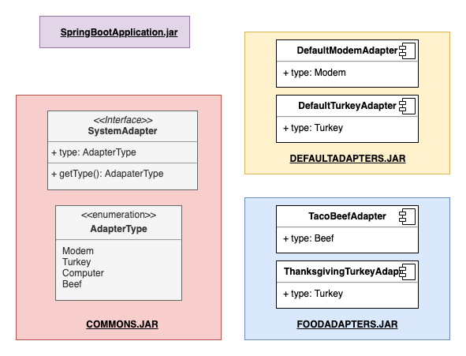

# Spring Boot - Dynamic Loading Jar Example

This project demonstrates how you can use SpringBoot to dynamically at run-time load in different implementation of an interface at run-time and have the application detect them.  This project mostly matches this structure:



```
commons
app
defaultSystemAdapter
foodAdapters
```

The first library is `commons` which defines the `SystemAdapter` protocol and an enum of `SystemAdapter` type.  Any implementation that we will load in later (`defaultSystemAdapter`, and `foodAdapters`) will need to reference this library in order to implement the protocol.

Our Application `app` is the main application and it includes a single `NullSystemAdapater` which is a default stand-in system adapter so it will compile.


the `run.sh` will build all 4 `jar` files.  

It will then run the system three times:
 
 * Without Any Adapters
 * With the DefaultAdapters
 * With the food Adapters

The `SystemAdapterFactory` will detect the loaded adapters and print out some basic info:

```java
@Service
public class SystemAdapterFactory {

    @Autowired
    List<SystemAdapter> adapters;


    @PostConstruct
    void listAdapters() {
        System.out.println("\n\n-------SYSTEM ADAPTERS ------\n");
        for (SystemAdapter adapter: adapters) {
            System.out.println("...Loaded Class: " + adapter.getClass() + " of type: " + adapter.getType().toString());
        }
        System.out.println("\n-------------------------------");
    }

}
```

So when we run it looks like this:


Running the app as-is
```
java -jar -jar app/build/libs/app-0.0.1-SNAPSHOT.jar
```

> -------SYSTEM ADAPTERS ------
> 
> ...Loaded Class: class org.company.adapters.NullAdapter of type: NULL
> 
> -------------------------------

Running with the first jar:

```
java -Dloader.path=file:./defaultImplementation/build/libs/defaultImplementation-0.0.1-SNAPSHOT.jar -Dloader.debug=false -jar app/build/libs/app-0.0.1-SNAPSHOT.jar
```

> -------SYSTEM ADAPTERS ------
> 
> ...Loaded Class: class org.company.adapters.DefaultTurkeyAdapter of type: Turkey
> ...Loaded Class: class org.company.adapters.DefaultModemAdapter of type: Modem
> ...Loaded Class: class org.company.adapters.NullAdapter of type: NULL
> 
> -------------------------------

And the second

```
java -Dloader.path=file:./foodAdapters/build/libs/foodAdapters-0.0.1-SNAPSHOT.jar -Dloader.debug=false -jar app/build/libs/app-0.0.1-SNAPSHOT.jar
```

> -------SYSTEM ADAPTERS ------
> 
> ...Loaded Class: class org.company.adapters.ThanksgivingAdapter of type: Turkey
> ...Loaded Class: class org.company.adapters.TacoTruckAdapter of type: Taco
> ...Loaded Class: class org.company.adapters.NullAdapter of type: NULL
> 
> -------------------------------